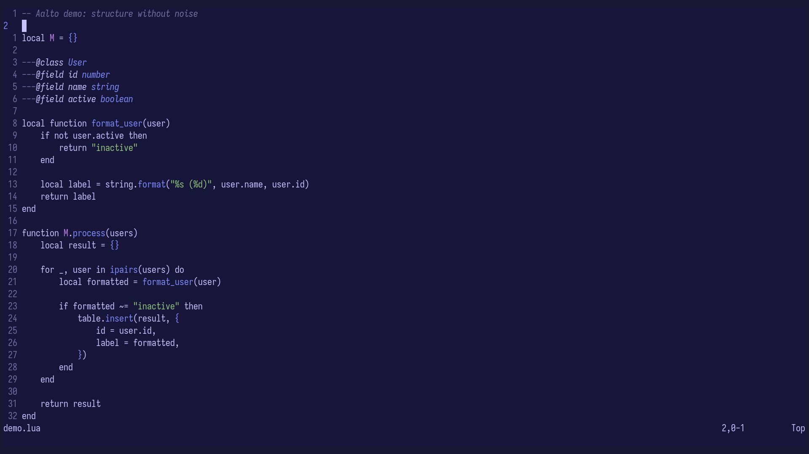

# 🌊 Aalto.nvim

> A minimal Neovim colorscheme where structure is visible and color stays quiet.



Structure is visible without demanding attention.

---

## 🌊 Origin

Aalto started from a simple tension:

Some themes are calm, but structure disappears.\
Others are expressive, but visually dense.

I wanted something in between:

- minimal, but not flat
- expressive, but not noisy

Aalto is that middle ground.

> **Color should communicate meaning — not decoration.**

---

## 🧠 What Aalto Is

Aalto is not just a palette.

It is a **rendering system**:

```
setup → palette → semantic → groups → UI
```

- color defines identity
- roles define meaning
- rendering applies meaning consistently

The colorscheme is the result of that system.

---

## ✨ Features

- 🎨 **Semantic-first** — 4-role system (structure, data, values, context)
- 👁 **Perceptual contrast** — OKLCH-based adjustments
- 🌊 **Low visual noise** — minimal, stable hierarchy
- 🔍 **Deep integration** — TreeSitter + LSP + plugins
- 🌗 **Adaptive variants** — dark / light / auto
- ♿ **Accessibility mode** — contrast-aware rendering
- ⚡ **Deterministic output** — same config → same result

---

## 📦 Installation

### lazy.nvim

```lua
{
  "micdzu/aalto.nvim",
  config = function()
    require("aalto").setup({})
    vim.cmd("colorscheme aalto")
  end
}
```

### packer.nvim

```lua
use {
  "micdzu/aalto.nvim",
  config = function()
    require("aalto").setup()
    vim.cmd("colorscheme aalto")
  end
}
```

### vim-plug

```vim
Plug 'micdzu/aalto.nvim'

lua require('aalto').setup()
colorscheme aalto
```

**Requirements:** Neovim 0.10+

---

## ⚙️ Quick Start

```lua
require("aalto").setup({
  variant = "dark",
})
```

---

## 🎛 Configuration

```lua
require("aalto").setup({
  -------------------------------------------------
  -- VARIANT
  -------------------------------------------------

  -- "dark" | "light" | nil (auto-detect from vim.o.background)
  variant = "dark",

  -------------------------------------------------
  -- ACCESSIBILITY
  -------------------------------------------------

  -- Adaptive contrast correction (OKLCH-based)
  accessibility = {
    enabled = false,
    contrast = 4.5, -- WCAG AA target
  },

  -------------------------------------------------
  -- SEMANTIC PALETTE OVERRIDES
  -------------------------------------------------

  -- Override semantic roles (not base palette!)
  -- Use this to change meaning → color mapping
  palette = {
    -- definition = "#7C8CFA",
    -- string     = "#8FC77C",
    -- constant   = "#B87EDC",
    -- comment    = "#746FA3",
  },

  -------------------------------------------------
  -- STYLE (NON-SEMANTIC)
  -------------------------------------------------

  -- Visual emphasis without changing meaning
  styles = {
    bold = true,
    italic = true,

    -- Granular control
    comments = { italic = true },

    -- Keywords are intentionally neutral (same color as text)
    -- Use style for subtle emphasis if desired
    keywords = {
      -- italic = true,
      -- bold = false,
    },
  },

  -------------------------------------------------
  -- BACKGROUND
  -------------------------------------------------

  -- Transparency support
  transparent = false,       -- main background
  float_transparent = false, -- floating windows

  -------------------------------------------------
  -- STRICT MODE
  -------------------------------------------------

  -- Remove all non-semantic styling
  -- (maximum minimalism)
  strict = false,

  -------------------------------------------------
  -- DEBUG
  -------------------------------------------------

  -- Print resolved palette to :messages
  debug = false,

  -------------------------------------------------
  -- FINAL OVERRIDES
  -------------------------------------------------

  -- Last-resort highlight overrides
  -- Use for unsupported plugins or personal tweaks
  overrides = {
    -- ["@keyword"] = { italic = true },
    -- NormalFloat = { bg = "NONE" },
  },
})
```

---

## 🎮 Commands

| Command                       | Description                |
| ----------------------------- | -------------------------- |
| `:AaltoVariant [dark\|light]` | Toggle or set variant      |
| `:AaltoAccessibility`         | Toggle adaptive contrast   |
| `:AaltoStatus`                | Show current configuration |

---

## 🧵 Native Statusline (Experimental)

Aalto includes a minimal, semantic statusline.

Unlike traditional statuslines, it does not use visual blocks or decorative
colors. Instead, it maps editor state to semantic roles:

- normal → structure (definition)
- insert → data (string)
- visual → values (constant)
- replace → destructive (error)
- command → action (warn)

The result is a statusline that stays quiet, yet meaningful.

Enable it via:

```lua
require("aalto").setup({
  statusline = true,
})
```

---

## 🧠 Semantic Model

Aalto uses **four roles**:

| Role       | Meaning                       |
| ---------- | ----------------------------- |
| definition | structure — functions, types  |
| string     | data — string literals        |
| constant   | values — numbers, booleans    |
| comment    | context — non-executable text |

Everything else is neutral.

> Fewer roles → stronger signal.

Keywords are intentionally de-emphasized.

They are treated as structural scaffolding rather than primary signals, allowing
definitions and values to carry the visual hierarchy.

---

## 👁 Perceptual Design

Aalto is tuned for **reading, not attention**.

- **definition** → anchors structure
- **string** → soft distinction
- **constant** → signal
- **comment** → recedes

Flow:

> structure → values → text → noise

---

## 🧘 Strict Mode

```lua
strict = true
```

Removes all decoration:

- no bold
- no italic
- no stylistic emphasis

Only meaning remains.

---

## 🧪 How to Evaluate Aalto

Aalto is not meant for screenshots.

To evaluate it:

1. Open real code
2. Work for 20–30 minutes
3. Notice:

   - how quickly structure appears
   - how little color distracts
   - how stable everything feels

If it disappears, it is working.

---

## 📚 Documentation

Aalto is small, but the system behind it is layered:

- 🧠 [Philosophy](./docs/philosophy.md) — why
- 🎨 [Palette](./docs/palette.md) — what
- 🧩 [Plugins](./docs/plugins.md) — where
- 🧪 [Design](./docs/design.md) — how

---

## 🧭 Where Aalto Fits

Different colorschemes optimize for different goals.

| Theme      | Focus                             | Experience                        |
| ---------- | --------------------------------- | --------------------------------- |
| **Aalto**  | Semantic structure, minimal roles | Long sessions, structural clarity |
| TokyoNight | Expressive palettes               | Visual richness, variety          |
| Gruvbox    | Warm tonal balance                | Comfort, familiarity              |
| Nord       | Low-contrast cool palette         | Calm, reduced visual stress       |
| Catppuccin | Soft pastel semantics             | Friendly, cohesive feel           |
| Monochrome | No color                          | Absolute minimalism               |

Aalto is not meant to replace expressive themes.

It exists for moments where structure matters more than color.

---

## 🤝 Supported Plugins

- Telescope
- FZF-Lua
- nvim-cmp / blink.cmp
- Gitsigns
- Neo-tree
- Which-key

Use `overrides` for unsupported plugins.

---

## 💬 Final Thought

> A colorscheme should not compete with your code.

Aalto does less — so your code becomes clearer.

---

## 📄 License

MIT
